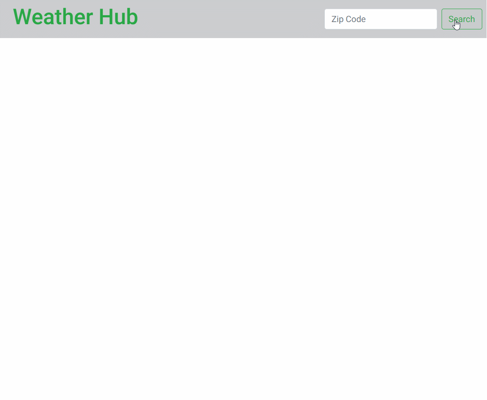

# weather-hub

A full-stack weather app using Weather API. Also allows users to save and delete favorite zip codes

## Technologies Used

- React.js
- Webpack 4
- Bootstrap 4
- Node.js
- Express
- PostgresQL
- HTML5
- CSS3

## Live Demo

Try the application live at [https://weather-hub-app.herokuapp.com/](https://weather-hub-app.herokuapp.com/)

## Features

- Users can view weather by zip code
- Users can favorite zip codes
- Users can delete a zip code from their favorites
- Users can view list of favorites when they begin to type
- Users can add items from that list to create an itinerary
- Users can click on any of the favorites to display the weather of that zip code

## Preview



## Development

### System Requirements

- Node.js 10 or higher
- NPM 6 or higher
- Postgres 10 or higher

### Getting Started

1. Clone the repository.

    ```shell
    git clone https://github.com/cbrisk/weather-app.git
    cd sgt-react
    ```

1. Install all dependencies with NPM.

    ```shell
    npm install
    ```

1. Create a Database for the app

    ```shell
    createdb weatherApp
    ```

1. Import the example database to PostgresQL.

    ```shell
    npm run db:import
    ```

1. Start the project. Once started you can view the application by opening http://localhost:3000 in your browser.

    ```shell
    npm run dev
    ```
